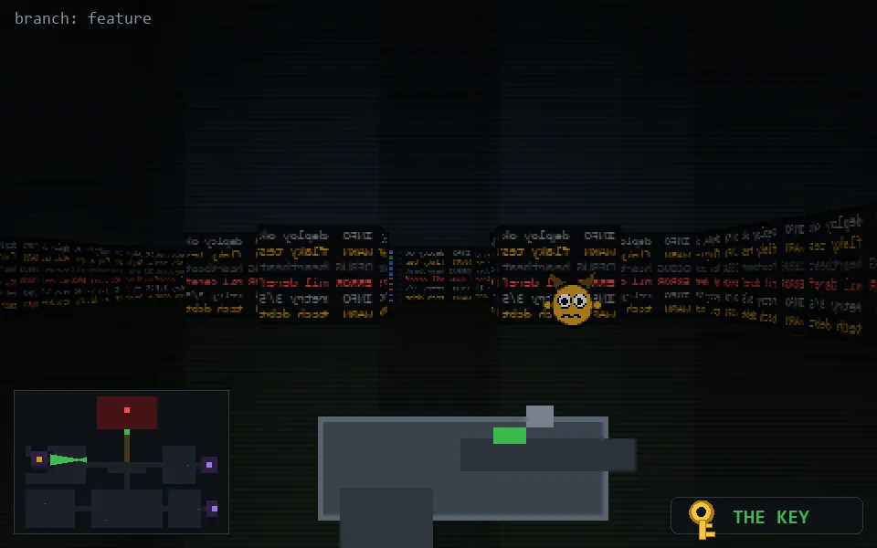

<!-- node:x12y12Wk -->
### `branch: feature` · 📍 (12, 12) · facing W · 🔑 THE KEY

|      |      |      |
|:----:|:----:|:----:|
|      | [⬆️](x11y12Wk.md) |      |
| [⬅️](x12y12Sk.md) | [💥](x12y12Wkd.md) | [➡️](x12y12Nk.md) |
|      | ⛔️ |      |

[⌂ index](../README.md)
