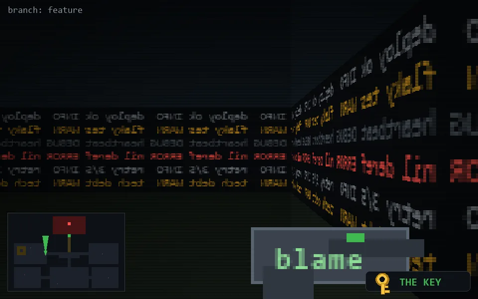

<!-- node:x12y13Nk -->
### `branch: feature` · 📍 (12, 13) · facing N · 🔑 THE KEY

|      |      |      |
|:----:|:----:|:----:|
|      | [⬆️](x12y12Nk.md) |      |
| [⬅️](x12y13Wk.md) | [💥](x12y13Nkd.md) | [➡️](x12y13Ek.md) |
|      | [⬇️](x12y14Nk.md) |      |

[⌂ index](../README.md)
