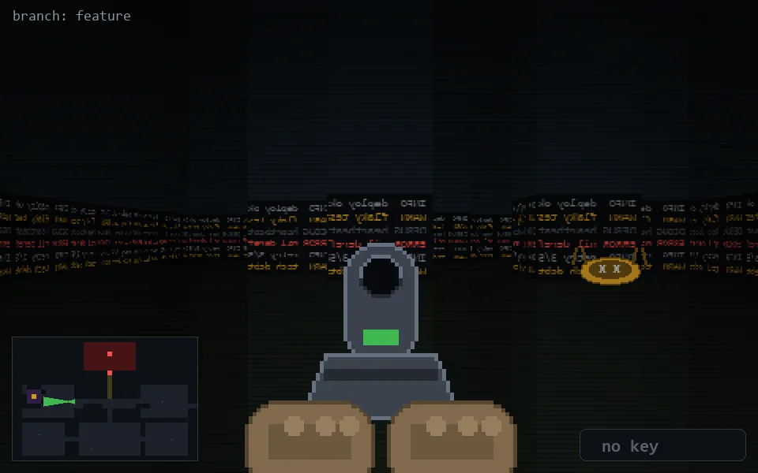

<!-- node:x12y13Wd -->
### `branch: feature` · 📍 (12, 13) · facing W · 🔑 — · ✖ bug deleted (it will be back)

|      |      |      |
|:----:|:----:|:----:|
|      | [⬆️](x11y13Wd.md) |      |
| [⬅️](x12y13Sd.md) | [💥](x12y13Wd.md) | [➡️](x12y13Nd.md) |
|      | [⬇️](x13y13Wd.md) |      |

[⌂ index](../README.md)
