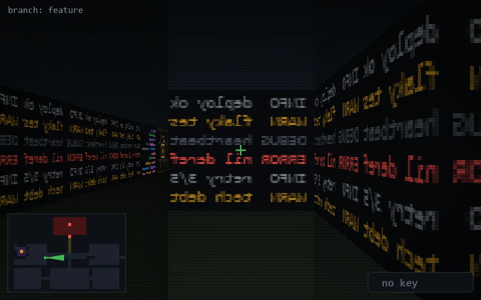

<!-- node:x12y14Ed -->
### `branch: feature` · 📍 (12, 14) · facing E · 🔑 — · ✖ bug deleted (it will be back)

|      |      |      |
|:----:|:----:|:----:|
|      | [⬆️](x13y14Ed.md) |      |
| [⬅️](x12y14Nd.md) | [💥](x12y14Ed.md) | [➡️](x12y14Sd.md) |
|      | [⬇️](x11y14Ed.md) |      |

[⌂ index](../README.md)
