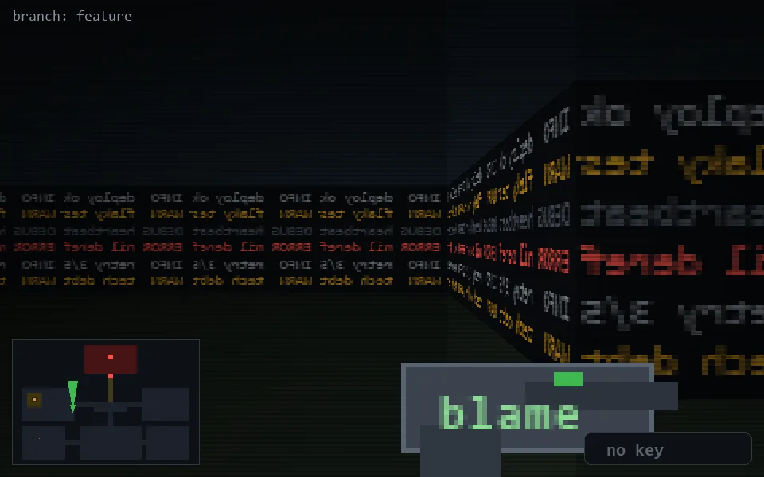

<!-- node:x12y14N -->
### `branch: feature` · 📍 (12, 14) · facing N · 🔑 —

|      |      |      |
|:----:|:----:|:----:|
|      | [⬆️](x12y13N.md) |      |
| [⬅️](x12y14W.md) | [💥](x12y14Nd.md) | [➡️](x12y14E.md) |
|      | [⬇️](x12y15N.md) |      |

[⌂ index](../README.md)
