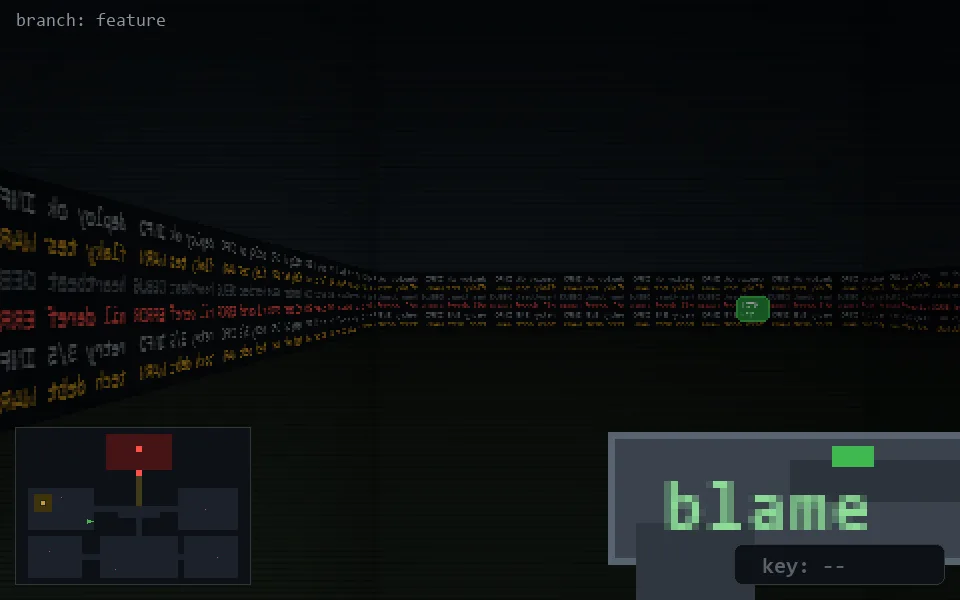

<!-- node:x12y15W -->
### `branch: feature` · 📍 (12, 15) · facing W · 🔑 —

|      |      |      |
|:----:|:----:|:----:|
|      | [⬆️](x11y15W.md) |      |
| [⬅️](x12y15S.md) | [💥](x12y15W.md) | [➡️](x12y15N.md) |
|      | ⛔️ |      |

[⌂ index](../README.md)
