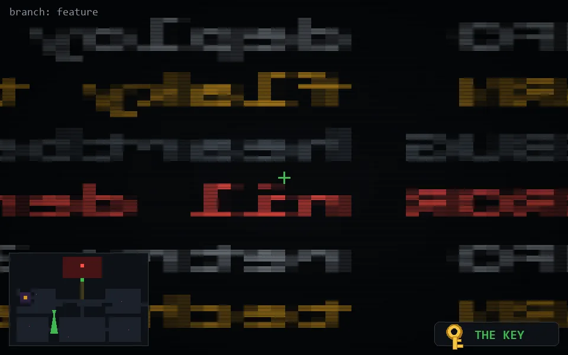

<!-- node:x12y16Sk -->
### `branch: feature` · 📍 (12, 16) · facing S · 🔑 THE KEY

|      |      |      |
|:----:|:----:|:----:|
|      | ⛔️ |      |
| [⬅️](x12y16Ek.md) | [💥](x12y16Sk.md) | [➡️](x12y16Wk.md) |
|      | [⬇️](x12y15Sk.md) |      |

[⌂ index](../README.md)
