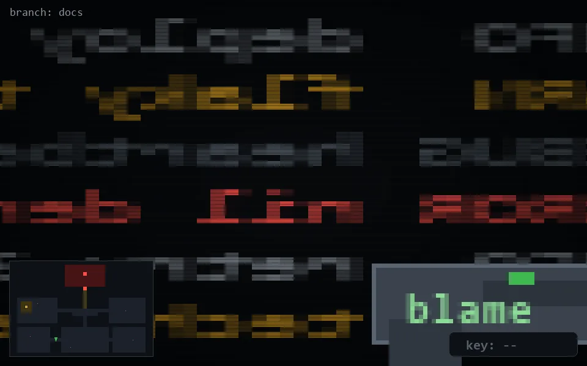

<!-- node:x12y21N -->
### `branch: docs` · 📍 (12, 21) · facing N · 🔑 —

|      |      |      |
|:----:|:----:|:----:|
|      | ⛔️ |      |
| [⬅️](x12y21W.md) | [💥](x12y21Nd.md) | [➡️](x12y21E.md) |
|      | ⛔️ |      |

[⌂ index](../README.md)
