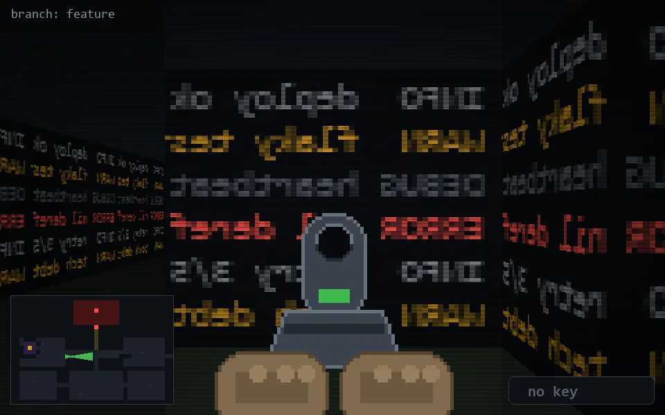

<!-- node:x13y14Ed -->
### `branch: feature` · 📍 (13, 14) · facing E · 🔑 — · ✖ bug deleted (it will be back)

|      |      |      |
|:----:|:----:|:----:|
|      | [⬆️](x14y14Ed.md) |      |
| [⬅️](x13y14Nd.md) | [💥](x13y14Ed.md) | [➡️](x13y14Sd.md) |
|      | [⬇️](x12y14Ed.md) |      |

[⌂ index](../README.md)
