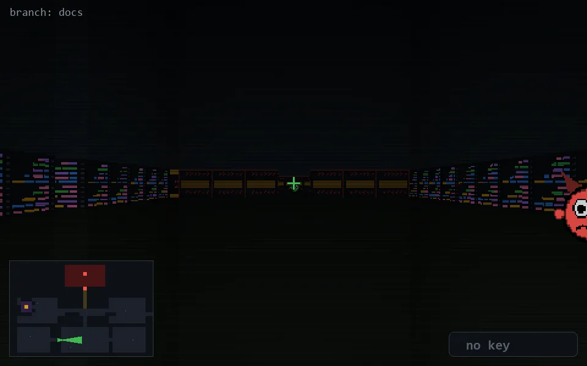

<!-- node:x13y21E -->
### `branch: docs` · 📍 (13, 21) · facing E · 🔑 —

|      |      |      |
|:----:|:----:|:----:|
|      | [⬆️](x14y21E.md) |      |
| [⬅️](x13y21N.md) | [💥](x13y21E.md) | [➡️](x13y21S.md) |
|      | [⬇️](x12y21E.md) |      |

[⌂ index](../README.md)
