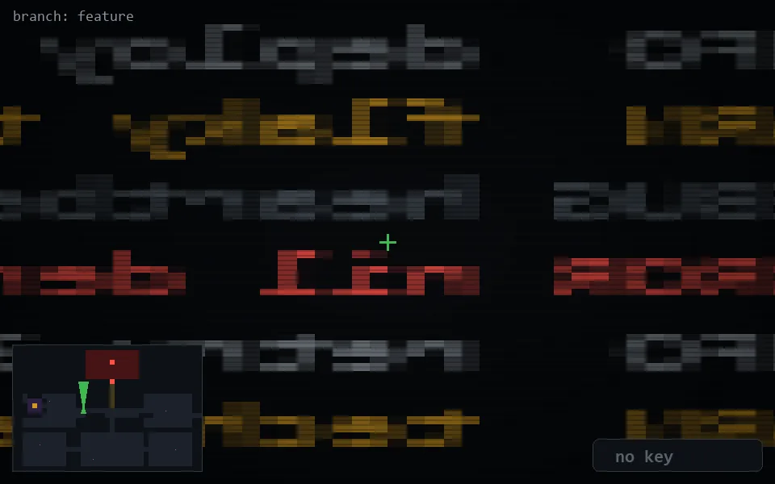

<!-- node:x14y13N -->
### `branch: feature` · 📍 (14, 13) · facing N · 🔑 —

|      |      |      |
|:----:|:----:|:----:|
|      | ⛔️ |      |
| [⬅️](x14y13W.md) | [💥](x14y13Nd.md) | [➡️](x14y13E.md) |
|      | [⬇️](x14y14N.md) |      |

[⌂ index](../README.md)
