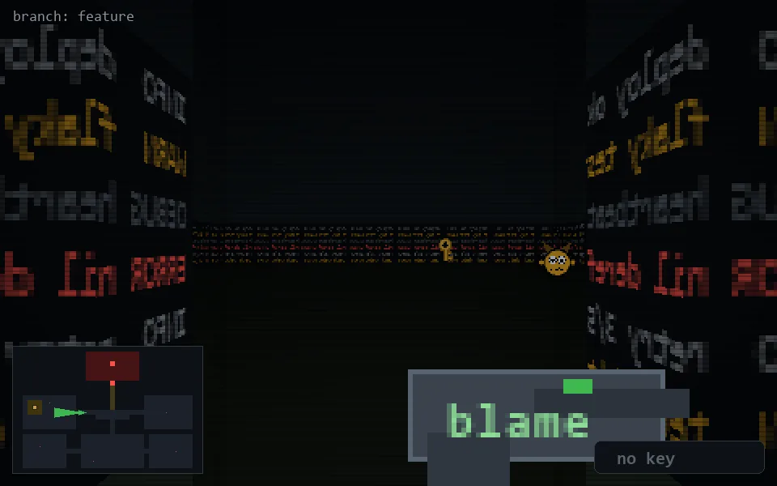

<!-- node:x14y13W -->
### `branch: feature` · 📍 (14, 13) · facing W · 🔑 —

|      |      |      |
|:----:|:----:|:----:|
|      | [⬆️](x13y13W.md) |      |
| [⬅️](x14y13S.md) | [💥](x14y13W.md) | [➡️](x14y13N.md) |
|      | [⬇️](x15y13W.md) |      |

[⌂ index](../README.md)
