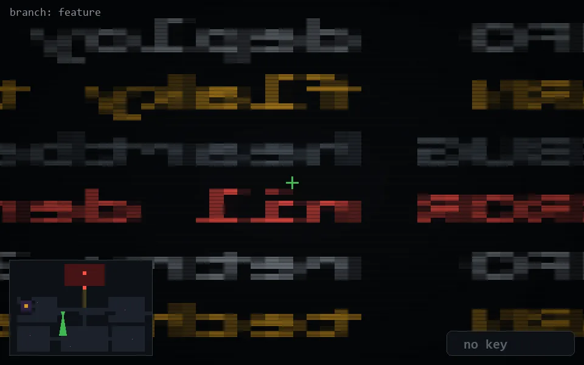

<!-- node:x14y14S -->
### `branch: feature` · 📍 (14, 14) · facing S · 🔑 —

|      |      |      |
|:----:|:----:|:----:|
|      | ⛔️ |      |
| [⬅️](x14y14E.md) | [💥](x14y14Sd.md) | [➡️](x14y14W.md) |
|      | [⬇️](x14y13S.md) |      |

[⌂ index](../README.md)
