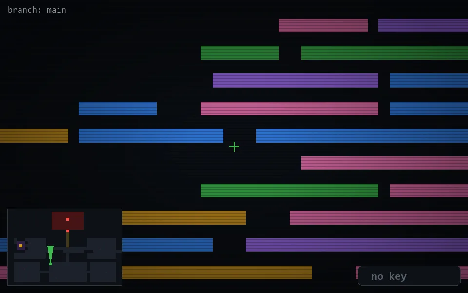

<!-- node:x14y18Nd -->
### `branch: main` · 📍 (14, 18) · facing N · 🔑 — · ✖ bug deleted (it will be back)

|      |      |      |
|:----:|:----:|:----:|
|      | ⛔️ |      |
| [⬅️](x14y18Wd.md) | [💥](x14y18Nd.md) | [➡️](x14y18Ed.md) |
|      | [⬇️](x14y19Nd.md) |      |

[⌂ index](../README.md)
