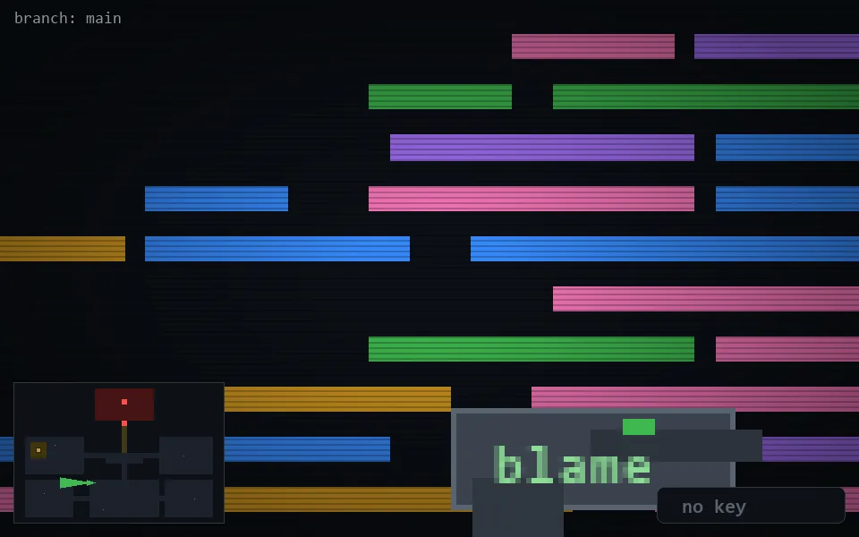

<!-- node:x14y18W -->
### `branch: main` · 📍 (14, 18) · facing W · 🔑 —

|      |      |      |
|:----:|:----:|:----:|
|      | ⛔️ |      |
| [⬅️](x14y18S.md) | [💥](x14y18Wd.md) | [➡️](x14y18N.md) |
|      | [⬇️](x15y18W.md) |      |

[⌂ index](../README.md)
