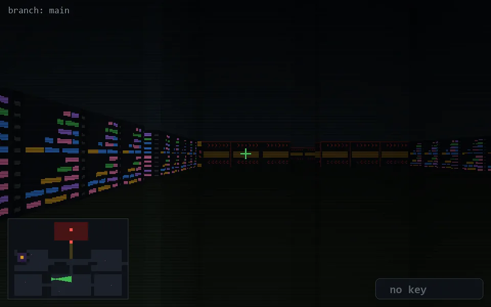

<!-- node:x14y19Ed -->
### `branch: main` · 📍 (14, 19) · facing E · 🔑 — · ✖ bug deleted (it will be back)

|      |      |      |
|:----:|:----:|:----:|
|      | [⬆️](x15y19Ed.md) |      |
| [⬅️](x14y19Nd.md) | [💥](x14y19Ed.md) | [➡️](x14y19Sd.md) |
|      | ⛔️ |      |

[⌂ index](../README.md)
