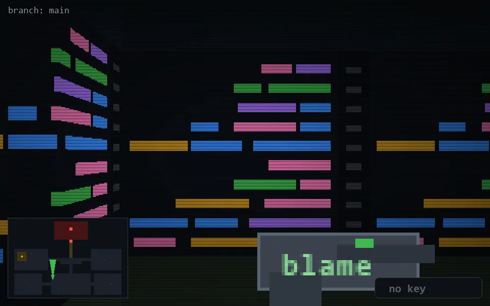

<!-- node:x14y19N -->
### `branch: main` · 📍 (14, 19) · facing N · 🔑 —

|      |      |      |
|:----:|:----:|:----:|
|      | [⬆️](x14y18N.md) |      |
| [⬅️](x14y19W.md) | [💥](x14y19Nd.md) | [➡️](x14y19E.md) |
|      | [⬇️](x14y20N.md) |      |

[⌂ index](../README.md)
