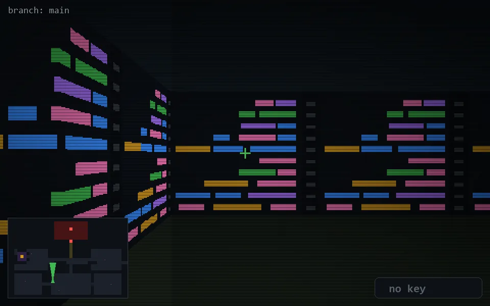

<!-- node:x14y20Nd -->
### `branch: main` · 📍 (14, 20) · facing N · 🔑 — · ✖ bug deleted (it will be back)

|      |      |      |
|:----:|:----:|:----:|
|      | [⬆️](x14y19Nd.md) |      |
| [⬅️](x14y20Wd.md) | [💥](x14y20Nd.md) | [➡️](x14y20Ed.md) |
|      | [⬇️](x14y21Nd.md) |      |

[⌂ index](../README.md)
