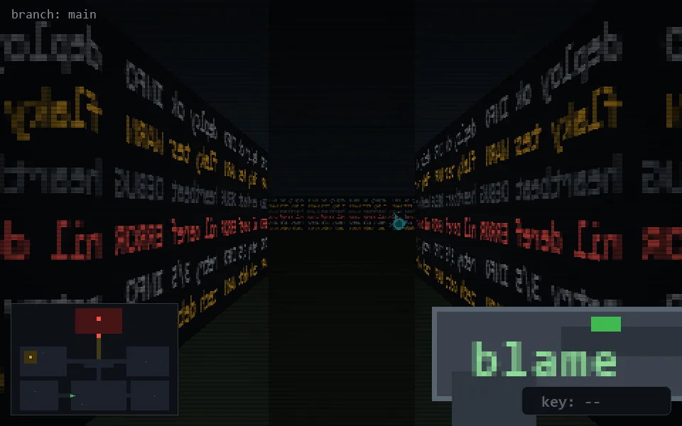

<!-- node:x14y21W -->
### `branch: main` · 📍 (14, 21) · facing W · 🔑 —

|      |      |      |
|:----:|:----:|:----:|
|      | [⬆️](x13y21W.md) |      |
| [⬅️](x14y21S.md) | [💥](x14y21W.md) | [➡️](x14y21N.md) |
|      | [⬇️](x15y21W.md) |      |

[⌂ index](../README.md)
