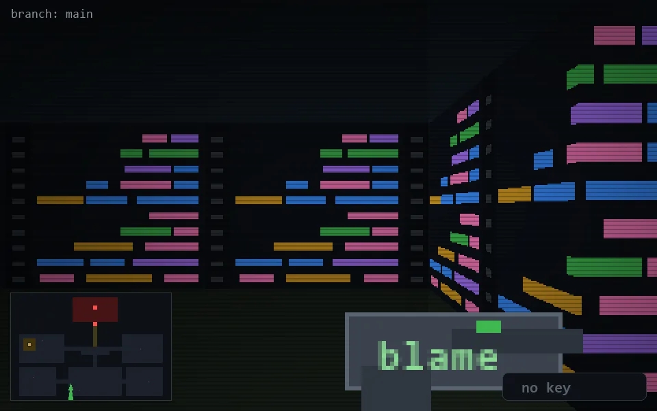

<!-- node:x14y22S -->
### `branch: main` · 📍 (14, 22) · facing S · 🔑 —

|      |      |      |
|:----:|:----:|:----:|
|      | [⬆️](x14y23S.md) |      |
| [⬅️](x14y22E.md) | [💥](x14y22S.md) | [➡️](x14y22W.md) |
|      | [⬇️](x14y21S.md) |      |

[⌂ index](../README.md)
