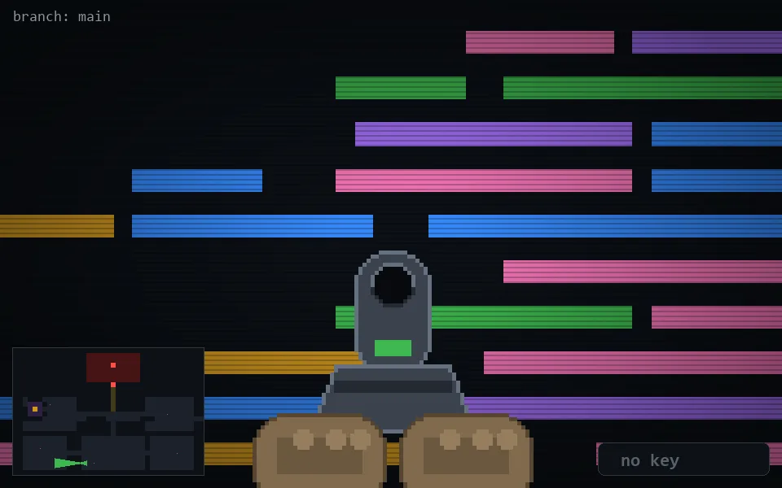

<!-- node:x14y23Wd -->
### `branch: main` · 📍 (14, 23) · facing W · 🔑 — · ✖ bug deleted (it will be back)

|      |      |      |
|:----:|:----:|:----:|
|      | ⛔️ |      |
| [⬅️](x14y23Sd.md) | [💥](x14y23Wd.md) | [➡️](x14y23Nd.md) |
|      | [⬇️](x15y23Wd.md) |      |

[⌂ index](../README.md)
