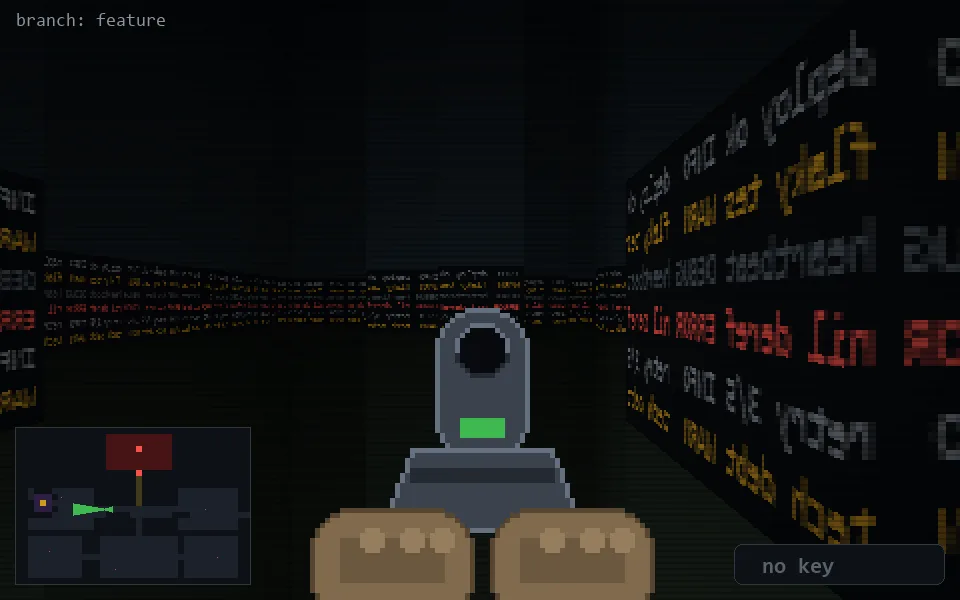

<!-- node:x15y13Wd -->
### `branch: feature` · 📍 (15, 13) · facing W · 🔑 — · ✖ bug deleted (it will be back)

|      |      |      |
|:----:|:----:|:----:|
|      | [⬆️](x14y13Wd.md) |      |
| [⬅️](x15y13Sd.md) | [💥](x15y13Wd.md) | [➡️](x15y13Nd.md) |
|      | [⬇️](x16y13Wd.md) |      |

[⌂ index](../README.md)
