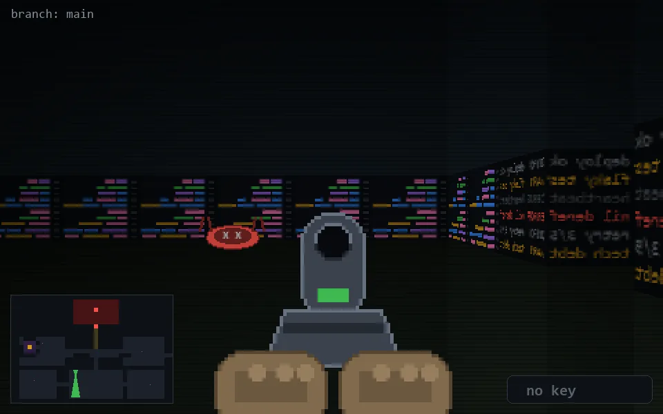

<!-- node:x15y18Sd -->
### `branch: main` · 📍 (15, 18) · facing S · 🔑 — · ✖ bug deleted (it will be back)

|      |      |      |
|:----:|:----:|:----:|
|      | [⬆️](x15y19Sd.md) |      |
| [⬅️](x15y18Ed.md) | [💥](x15y18Sd.md) | [➡️](x15y18Wd.md) |
|      | ⛔️ |      |

[⌂ index](../README.md)
