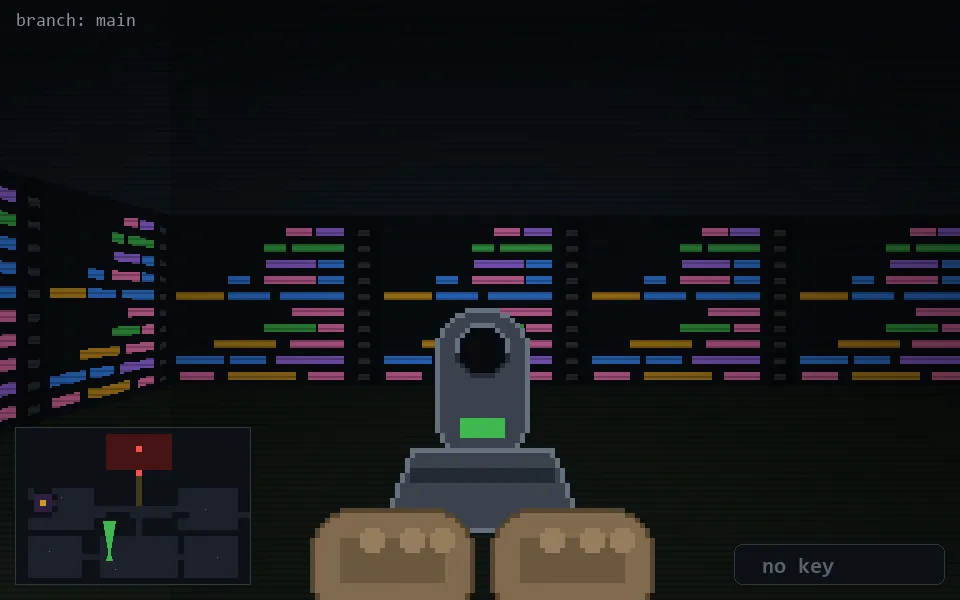

<!-- node:x15y21Nd -->
### `branch: main` · 📍 (15, 21) · facing N · 🔑 — · ✖ bug deleted (it will be back)

|      |      |      |
|:----:|:----:|:----:|
|      | [⬆️](x15y20Nd.md) |      |
| [⬅️](x15y21Wd.md) | [💥](x15y21Nd.md) | [➡️](x15y21Ed.md) |
|      | [⬇️](x15y22Nd.md) |      |

[⌂ index](../README.md)
