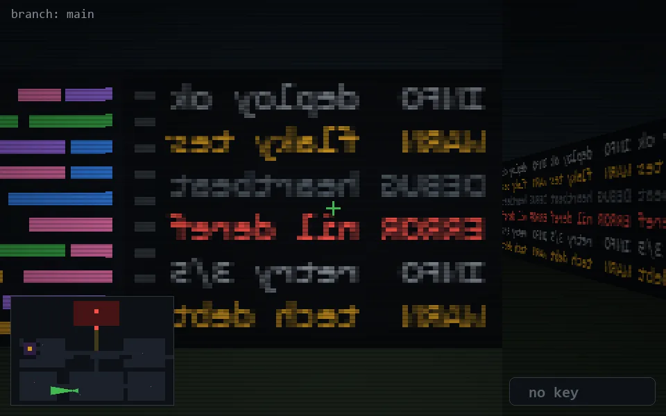

<!-- node:x15y22W -->
### `branch: main` · 📍 (15, 22) · facing W · 🔑 —

|      |      |      |
|:----:|:----:|:----:|
|      | [⬆️](x14y22W.md) |      |
| [⬅️](x15y22S.md) | [💥](x15y22W.md) | [➡️](x15y22N.md) |
|      | [⬇️](x16y22W.md) |      |

[⌂ index](../README.md)
