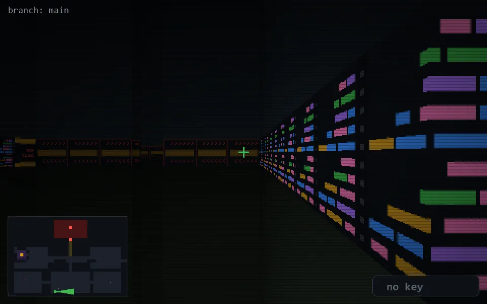

<!-- node:x15y24E -->
### `branch: main` · 📍 (15, 24) · facing E · 🔑 —

|      |      |      |
|:----:|:----:|:----:|
|      | [⬆️](x16y24E.md) |      |
| [⬅️](x15y24N.md) | [💥](x15y24E.md) | [➡️](x15y24S.md) |
|      | [⬇️](x14y24E.md) |      |

[⌂ index](../README.md)
