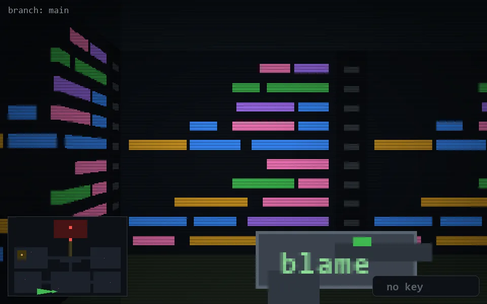

<!-- node:x15y24W -->
### `branch: main` · 📍 (15, 24) · facing W · 🔑 —

|      |      |      |
|:----:|:----:|:----:|
|      | [⬆️](x14y24W.md) |      |
| [⬅️](x15y24S.md) | [💥](x15y24W.md) | [➡️](x15y24N.md) |
|      | [⬇️](x16y24W.md) |      |

[⌂ index](../README.md)
