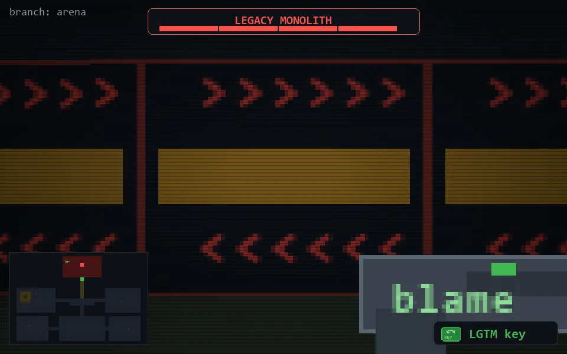

<!-- node:x16y02Wh4 -->
### `branch: prod` · 📍 (16, 2) · facing W · ⚔ monolith [████ 4/4]

|      |      |      |
|:----:|:----:|:----:|
|      | [⬆️](x15y02Wh4.md) |      |
| [⬅️](x16y02Sh4.md) | [💥](x16y02Wh3.md) | [➡️](x16y02Nh4.md) |
|      | [⬇️](x17y02Wh4.md) |      |

[⌂ index](../README.md)
