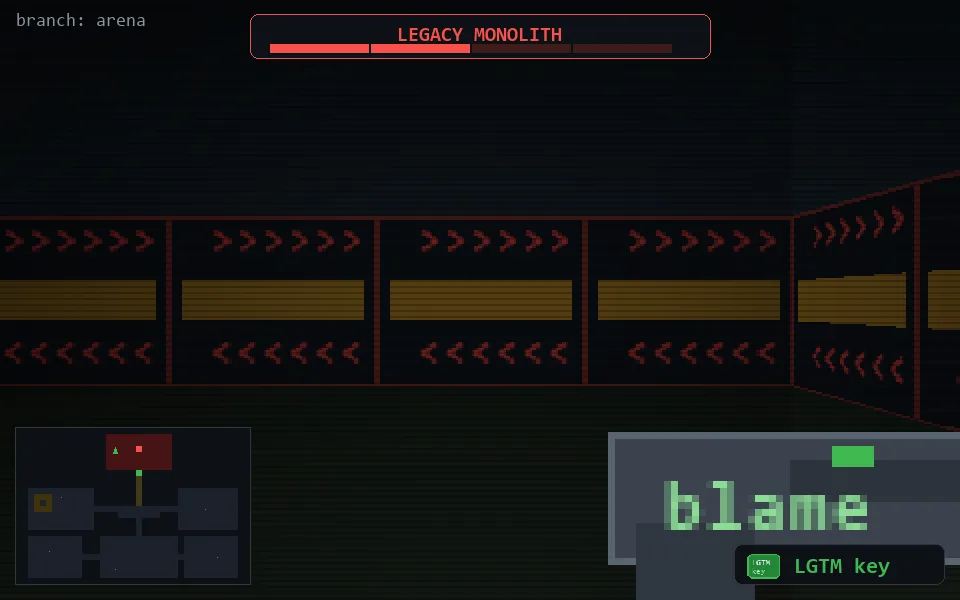

<!-- node:x16y03Sh2 -->
### `branch: prod` · 📍 (16, 3) · facing S · ⚔ monolith [██░░ 2/4]

|      |      |      |
|:----:|:----:|:----:|
|      | [⬆️](x16y04Sh2.md) |      |
| [⬅️](x16y03Eh2.md) | [💥](x16y03Sh1.md) | [➡️](x16y03Wh2.md) |
|      | [⬇️](x16y02Sh2.md) |      |

[⌂ index](../README.md)
