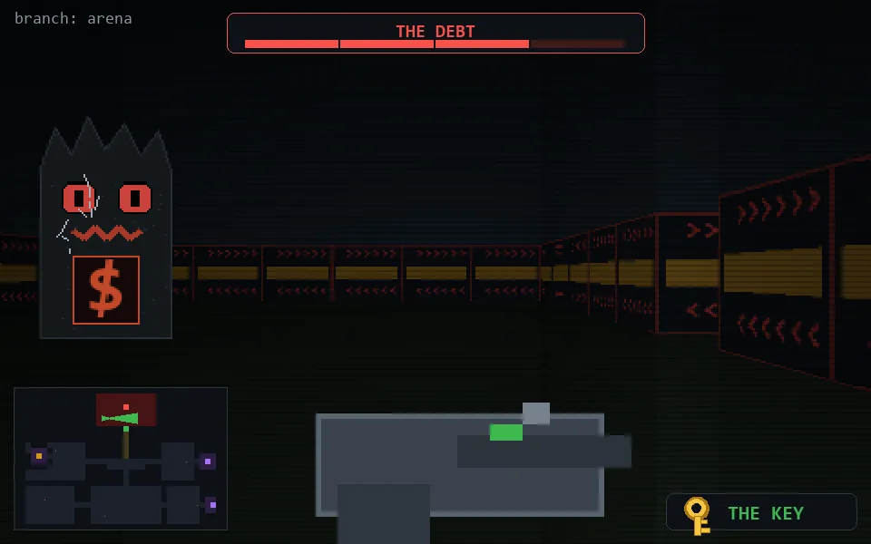

<!-- node:x16y05Eh3 -->
### `branch: prod` · 📍 (16, 5) · facing E · ⚔ monolith [███░ 3/4]

|      |      |      |
|:----:|:----:|:----:|
|      | [⬆️](x17y05Eh3.md) |      |
| [⬅️](x16y05Nh3.md) | [💥](x16y05Eh2.md) | [➡️](x16y05Sh3.md) |
|      | [⬇️](x15y05Eh3.md) |      |

[⌂ index](../README.md)
