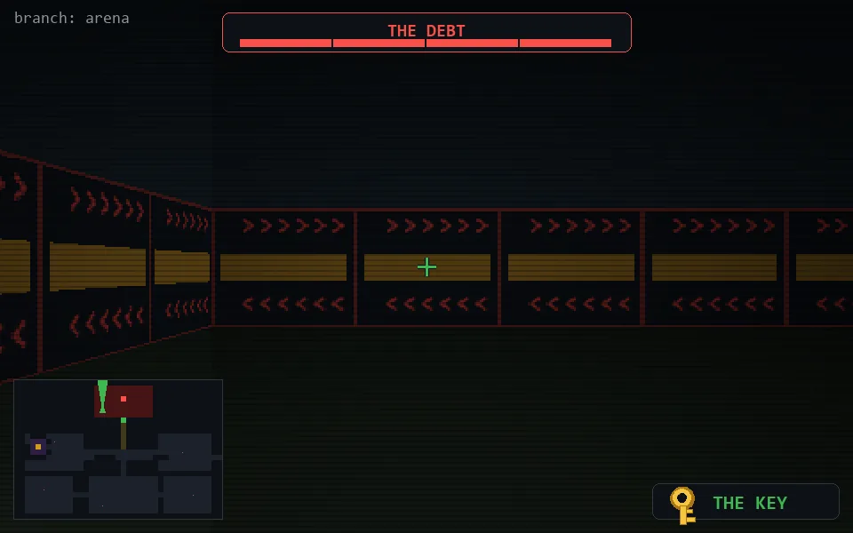

<!-- node:x16y05Nh4 -->
### `branch: prod` · 📍 (16, 5) · facing N · ⚔ monolith [████ 4/4]

|      |      |      |
|:----:|:----:|:----:|
|      | [⬆️](x16y04Nh4.md) |      |
| [⬅️](x16y05Wh4.md) | [💥](x16y05Nh3.md) | [➡️](x16y05Eh4.md) |
|      | [⬇️](x16y06Nh4.md) |      |

[⌂ index](../README.md)
