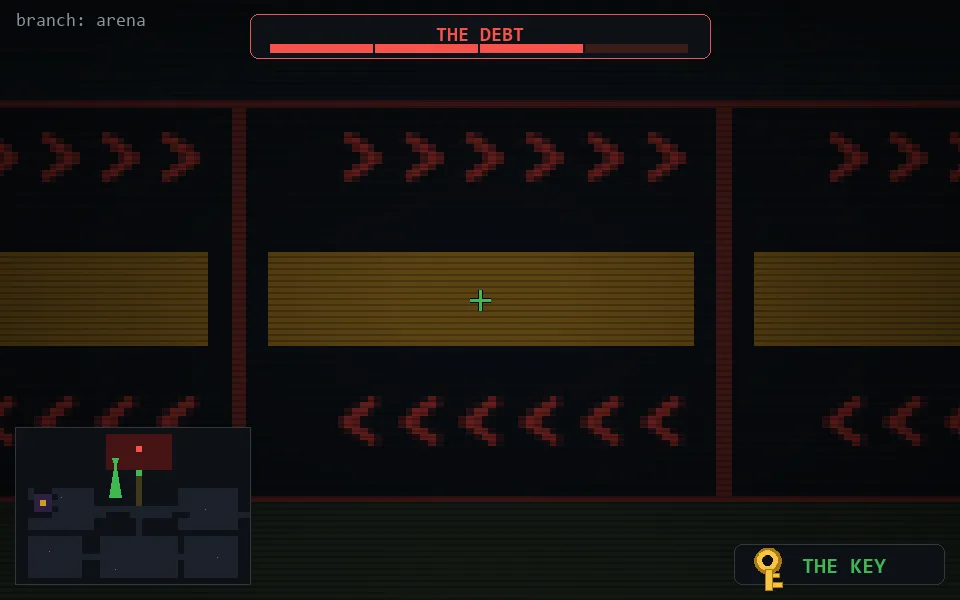

<!-- node:x16y05Sh3 -->
### `branch: prod` · 📍 (16, 5) · facing S · ⚔ monolith [███░ 3/4]

|      |      |      |
|:----:|:----:|:----:|
|      | [⬆️](x16y06Sh3.md) |      |
| [⬅️](x16y05Eh3.md) | [💥](x16y05Sh2.md) | [➡️](x16y05Wh3.md) |
|      | [⬇️](x16y04Sh3.md) |      |

[⌂ index](../README.md)
