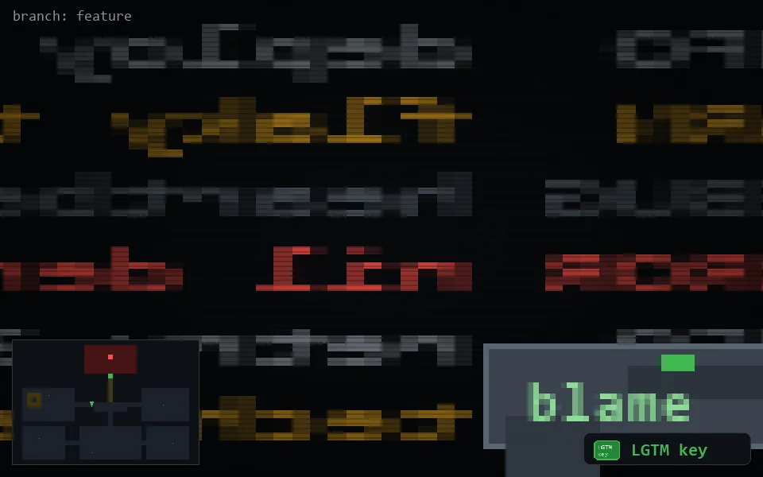

<!-- node:x16y13Nk -->
### `branch: feature` · 📍 (16, 13) · facing N · 🔑 THE KEY

|      |      |      |
|:----:|:----:|:----:|
|      | ⛔️ |      |
| [⬅️](x16y13Wk.md) | [💥](x16y13Nkd.md) | [➡️](x16y13Ek.md) |
|      | ⛔️ |      |

[⌂ index](../README.md)
