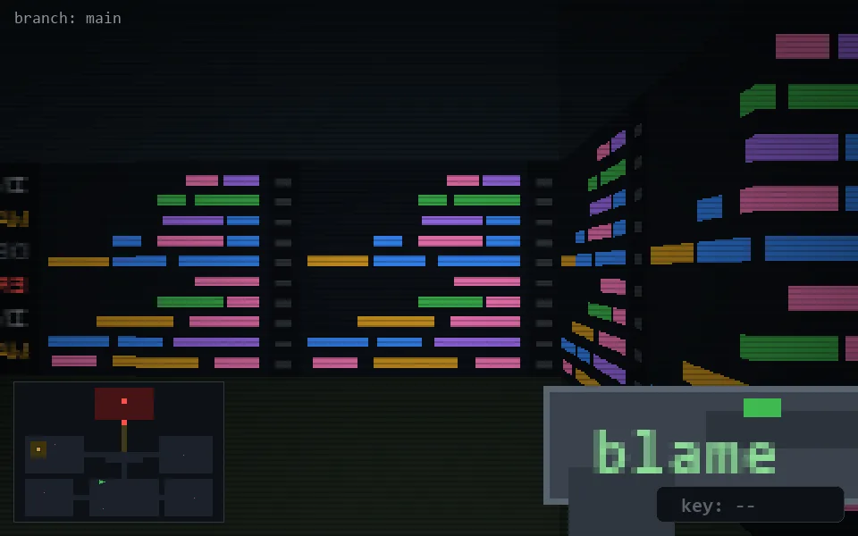

<!-- node:x16y18W -->
### `branch: main` · 📍 (16, 18) · facing W · 🔑 —

|      |      |      |
|:----:|:----:|:----:|
|      | [⬆️](x15y18W.md) |      |
| [⬅️](x16y18S.md) | [💥](x16y18W.md) | [➡️](x16y18N.md) |
|      | [⬇️](x17y18W.md) |      |

[⌂ index](../README.md)
