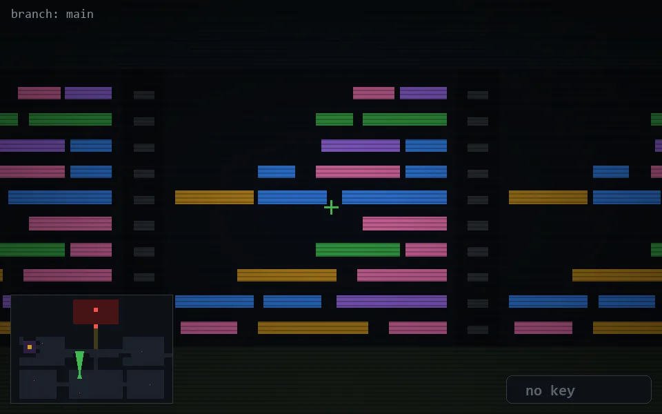

<!-- node:x16y19Nd -->
### `branch: main` · 📍 (16, 19) · facing N · 🔑 — · ✖ bug deleted (it will be back)

|      |      |      |
|:----:|:----:|:----:|
|      | [⬆️](x16y18Nd.md) |      |
| [⬅️](x16y19Wd.md) | [💥](x16y19Nd.md) | [➡️](x16y19Ed.md) |
|      | [⬇️](x16y20Nd.md) |      |

[⌂ index](../README.md)
