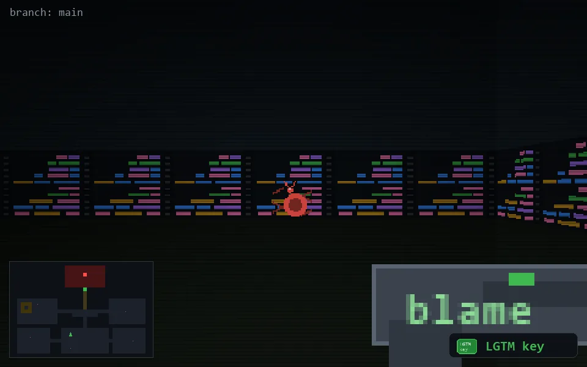

<!-- node:x16y19Sk -->
### `branch: main` · 📍 (16, 19) · facing S · 🔑 LGTM

|      |      |      |
|:----:|:----:|:----:|
|      | [⬆️](x16y20Sk.md) |      |
| [⬅️](x16y19Ek.md) | [💥](x16y19Sk.md) | [➡️](x16y19Wk.md) |
|      | [⬇️](x16y18Sk.md) |      |

[⌂ index](../README.md)
