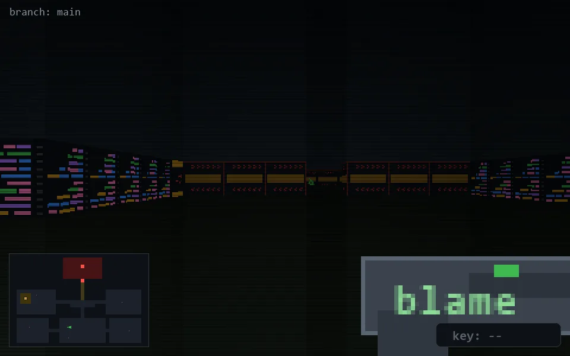

<!-- node:x16y20E -->
### `branch: main` · 📍 (16, 20) · facing E · 🔑 —

|      |      |      |
|:----:|:----:|:----:|
|      | [⬆️](x17y20E.md) |      |
| [⬅️](x16y20N.md) | [💥](x16y20Ed.md) | [➡️](x16y20S.md) |
|      | [⬇️](x15y20E.md) |      |

[⌂ index](../README.md)
