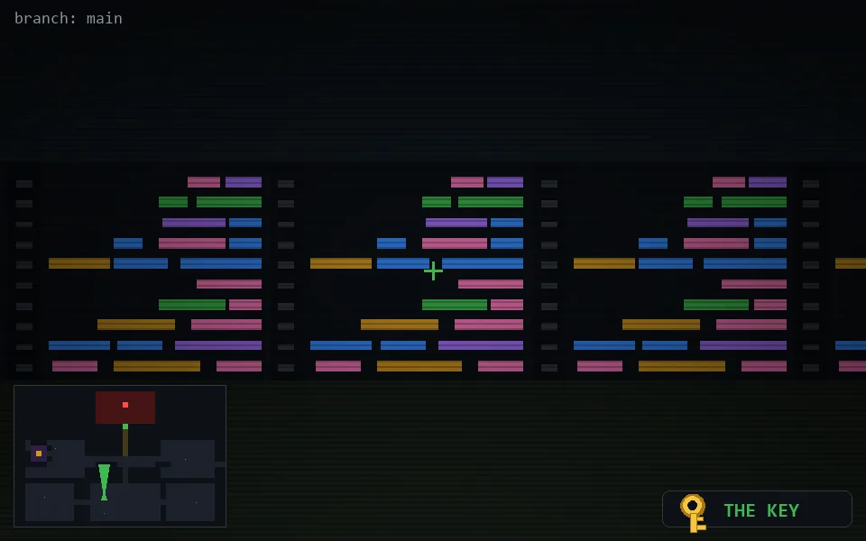

<!-- node:x16y20Nk -->
### `branch: main` · 📍 (16, 20) · facing N · 🔑 LGTM

|      |      |      |
|:----:|:----:|:----:|
|      | [⬆️](x16y19Nk.md) |      |
| [⬅️](x16y20Wk.md) | [💥](x16y20Nk.md) | [➡️](x16y20Ek.md) |
|      | [⬇️](x16y21Nk.md) |      |

[⌂ index](../README.md)
