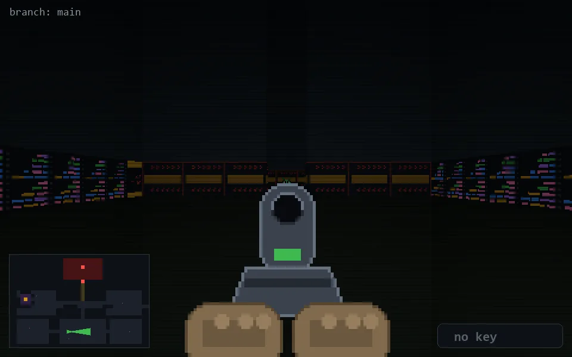

<!-- node:x16y21Ed -->
### `branch: main` · 📍 (16, 21) · facing E · 🔑 — · ✖ bug deleted (it will be back)

|      |      |      |
|:----:|:----:|:----:|
|      | [⬆️](x17y21Ed.md) |      |
| [⬅️](x16y21Nd.md) | [💥](x16y21Ed.md) | [➡️](x16y21Sd.md) |
|      | [⬇️](x15y21Ed.md) |      |

[⌂ index](../README.md)
