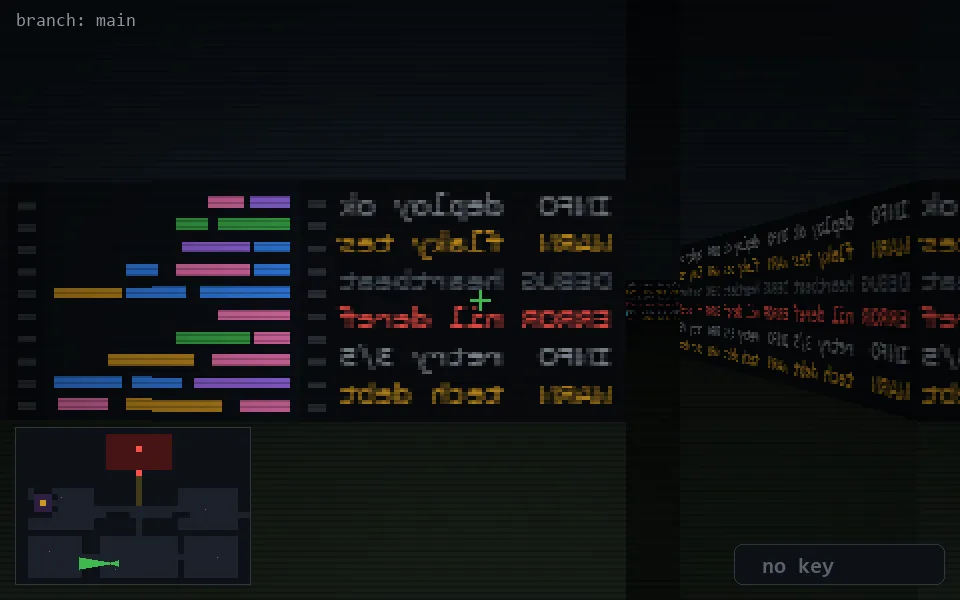

<!-- node:x16y22Wd -->
### `branch: main` · 📍 (16, 22) · facing W · 🔑 — · ✖ bug deleted (it will be back)

|      |      |      |
|:----:|:----:|:----:|
|      | [⬆️](x15y22Wd.md) |      |
| [⬅️](x16y22Sd.md) | [💥](x16y22Wd.md) | [➡️](x16y22Nd.md) |
|      | [⬇️](x17y22Wd.md) |      |

[⌂ index](../README.md)
