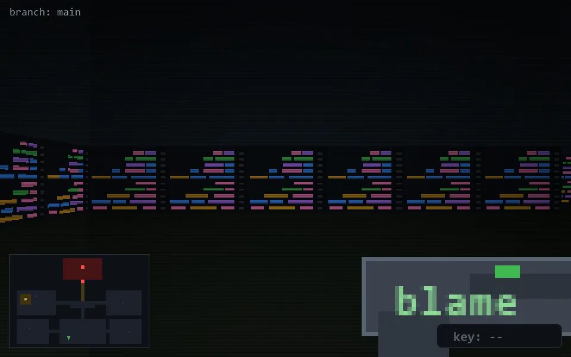

<!-- node:x16y23N -->
### `branch: main` · 📍 (16, 23) · facing N · 🔑 —

|      |      |      |
|:----:|:----:|:----:|
|      | [⬆️](x16y22N.md) |      |
| [⬅️](x16y23W.md) | [💥](x16y23Nd.md) | [➡️](x16y23E.md) |
|      | [⬇️](x16y24N.md) |      |

[⌂ index](../README.md)
