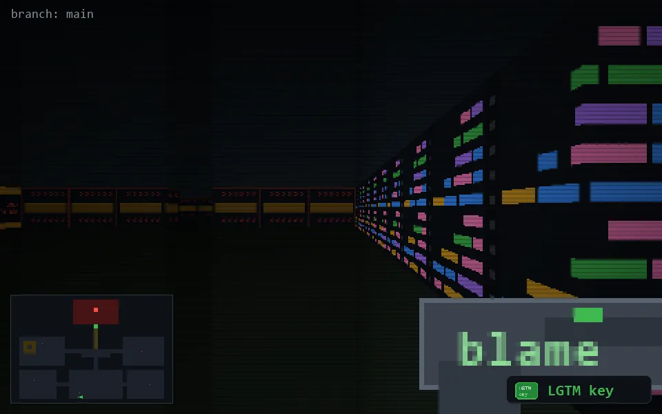

<!-- node:x16y24Ek -->
### `branch: main` · 📍 (16, 24) · facing E · 🔑 THE KEY

|      |      |      |
|:----:|:----:|:----:|
|      | [⬆️](x17y24Ek.md) |      |
| [⬅️](x16y24Nk.md) | [💥](x16y24Ekd.md) | [➡️](x16y24Sk.md) |
|      | [⬇️](x15y24Ek.md) |      |

[⌂ index](../README.md)
