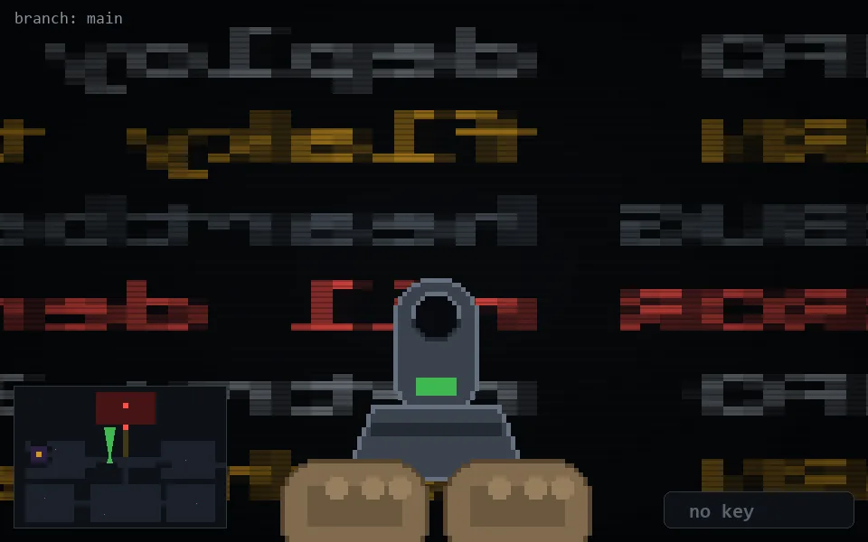

<!-- node:x17y13Nd -->
### `branch: main` · 📍 (17, 13) · facing N · 🔑 — · ✖ bug deleted (it will be back)

|      |      |      |
|:----:|:----:|:----:|
|      | ⛔️ |      |
| [⬅️](x17y13Wd.md) | [💥](x17y13Nd.md) | [➡️](x17y13Ed.md) |
|      | ⛔️ |      |

[⌂ index](../README.md)
