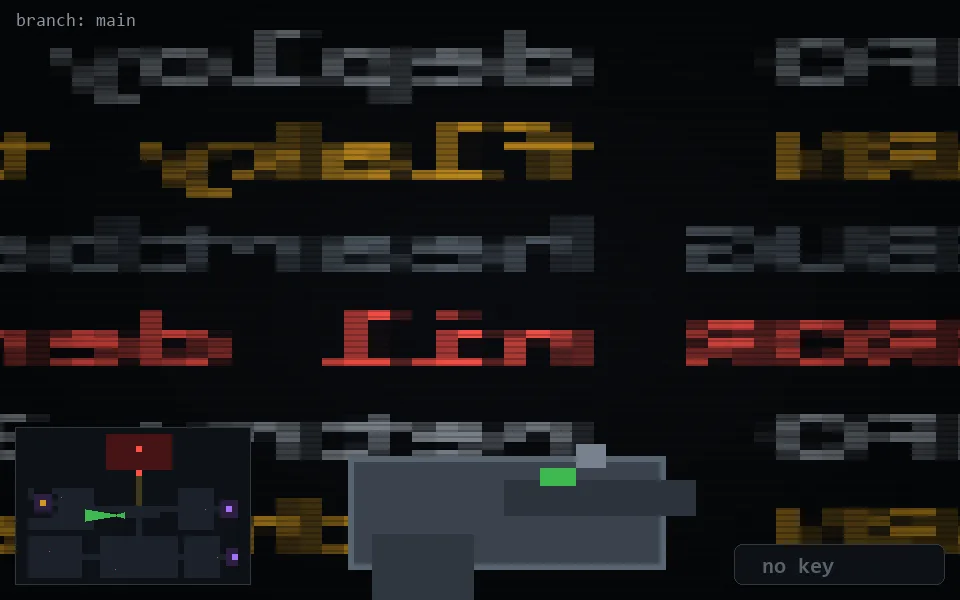

<!-- node:x17y14W -->
### `branch: main` · 📍 (17, 14) · facing W · 🔑 —

|      |      |      |
|:----:|:----:|:----:|
|      | ⛔️ |      |
| [⬅️](x17y14S.md) | [💥](x17y14W.md) | [➡️](x17y14N.md) |
|      | [⬇️](x18y14W.md) |      |

[⌂ index](../README.md)
