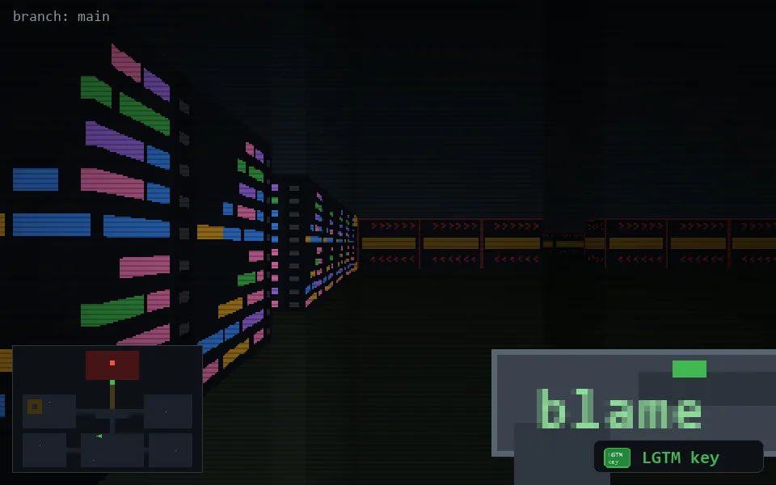

<!-- node:x17y18Ek -->
### `branch: main` · 📍 (17, 18) · facing E · 🔑 LGTM

|      |      |      |
|:----:|:----:|:----:|
|      | [⬆️](x18y18Ek.md) |      |
| [⬅️](x17y18Nk.md) | [💥](x17y18Ek.md) | [➡️](x17y18Sk.md) |
|      | [⬇️](x16y18Ek.md) |      |

[⌂ index](../README.md)
