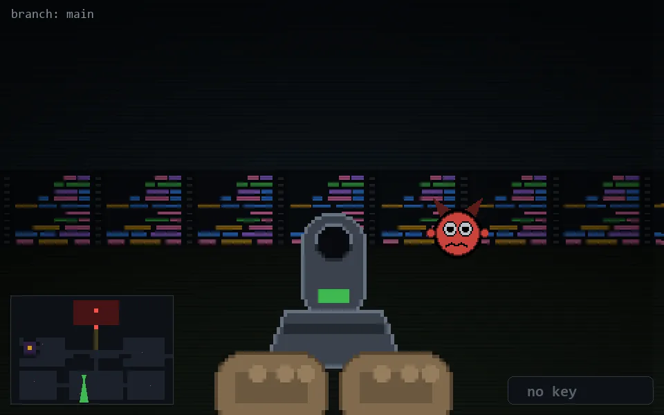

<!-- node:x17y19S -->
### `branch: main` · 📍 (17, 19) · facing S · 🔑 —

|      |      |      |
|:----:|:----:|:----:|
|      | [⬆️](x17y20S.md) |      |
| [⬅️](x17y19E.md) | [💥](x17y19S.md) | [➡️](x17y19W.md) |
|      | [⬇️](x17y18S.md) |      |

[⌂ index](../README.md)
