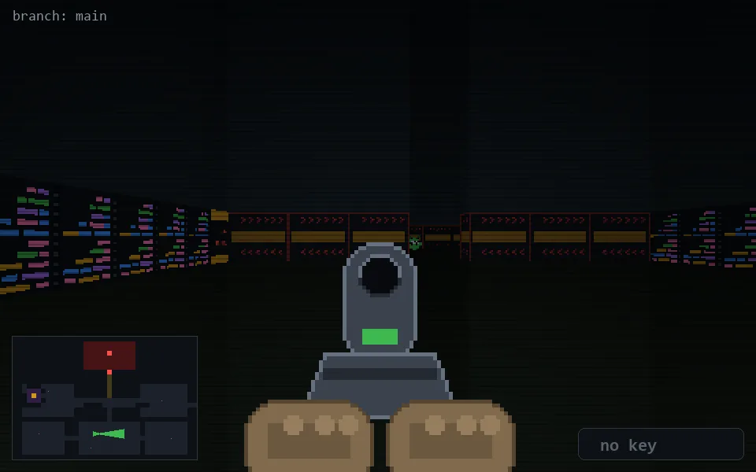

<!-- node:x17y20Ed -->
### `branch: main` · 📍 (17, 20) · facing E · 🔑 — · ✖ bug deleted (it will be back)

|      |      |      |
|:----:|:----:|:----:|
|      | [⬆️](x18y20Ed.md) |      |
| [⬅️](x17y20Nd.md) | [💥](x17y20Ed.md) | [➡️](x17y20Sd.md) |
|      | [⬇️](x16y20Ed.md) |      |

[⌂ index](../README.md)
