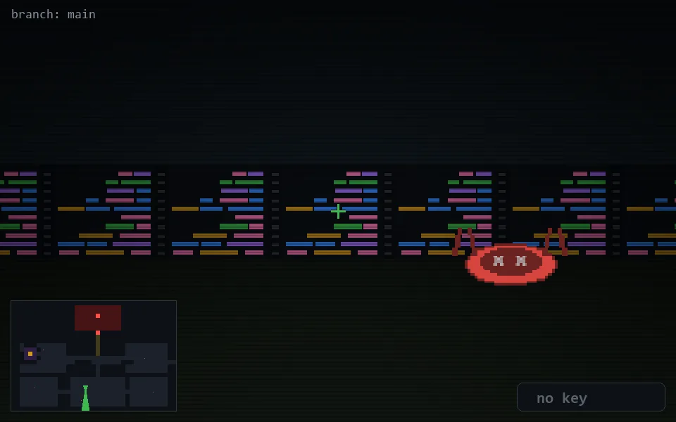

<!-- node:x17y20Sd -->
### `branch: main` · 📍 (17, 20) · facing S · 🔑 — · ✖ bug deleted (it will be back)

|      |      |      |
|:----:|:----:|:----:|
|      | [⬆️](x17y21Sd.md) |      |
| [⬅️](x17y20Ed.md) | [💥](x17y20Sd.md) | [➡️](x17y20Wd.md) |
|      | [⬇️](x17y19Sd.md) |      |

[⌂ index](../README.md)
