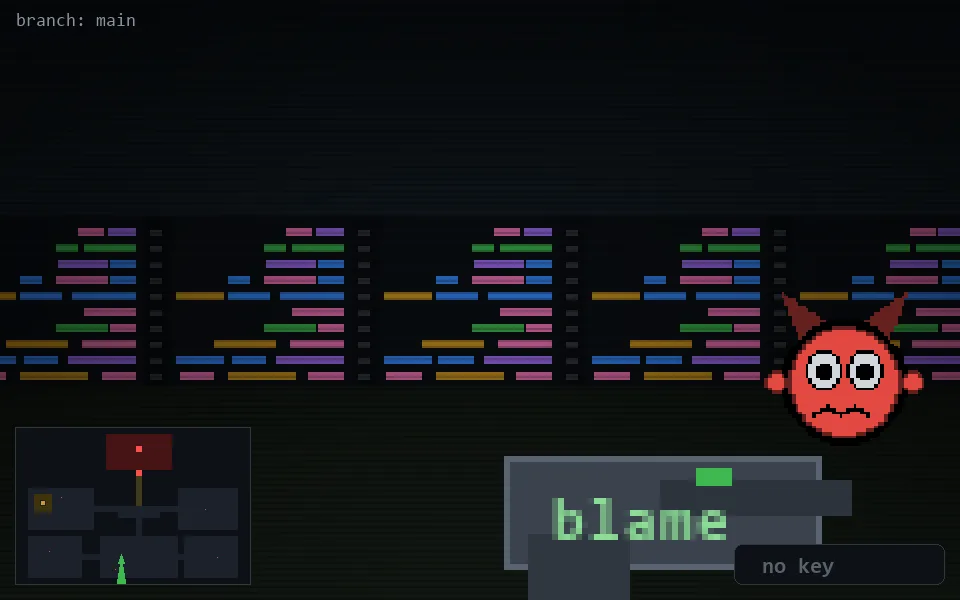

<!-- node:x17y21S -->
### `branch: main` · 📍 (17, 21) · facing S · 🔑 —

|      |      |      |
|:----:|:----:|:----:|
|      | [⬆️](x17y22S.md) |      |
| [⬅️](x17y21E.md) | [💥](x17y21Sd.md) | [➡️](x17y21W.md) |
|      | [⬇️](x17y20S.md) |      |

[⌂ index](../README.md)
