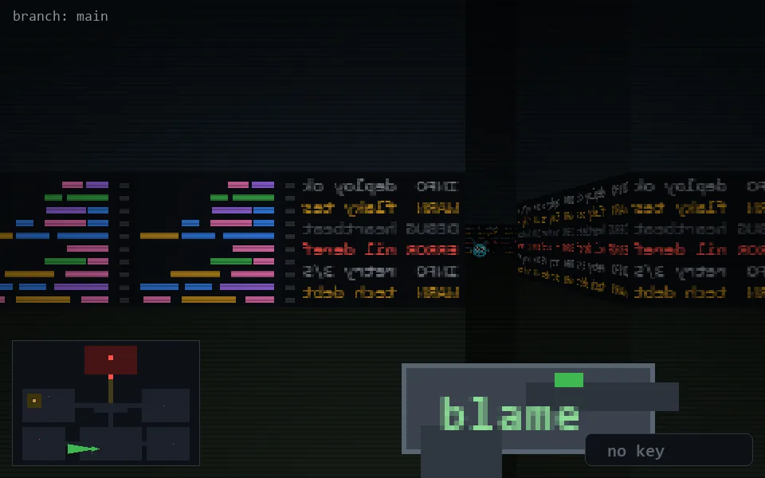

<!-- node:x17y22W -->
### `branch: main` · 📍 (17, 22) · facing W · 🔑 —

|      |      |      |
|:----:|:----:|:----:|
|      | [⬆️](x16y22W.md) |      |
| [⬅️](x17y22S.md) | [💥](x17y22Wd.md) | [➡️](x17y22N.md) |
|      | [⬇️](x18y22W.md) |      |

[⌂ index](../README.md)
